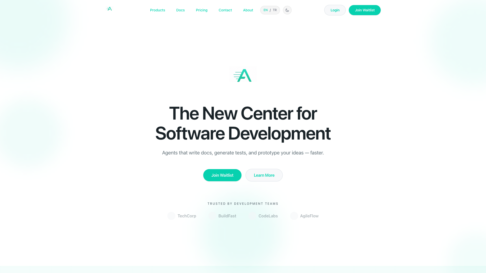
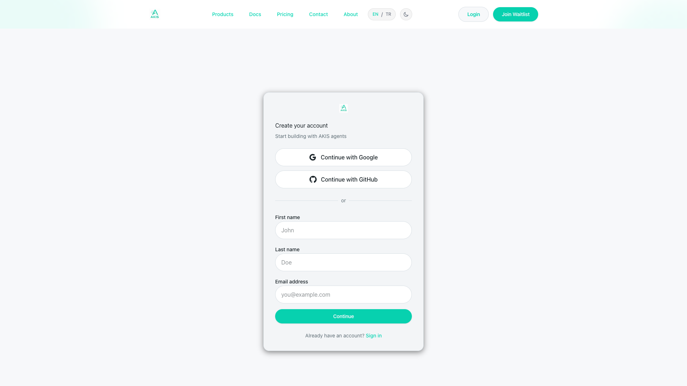

# AKIS Platform

**Yazılım Geliştirme için Yapay Zeka Ajan Orkestrasyon Sistemi**

> 🌐 [English version → README.en.md](README.en.md)

AKIS, tekrarlayan yazılım mühendisliği görevlerini — dokümantasyon, test planlaması ve prototipleme — otonom yapay zeka ajanları aracılığıyla otomatikleştirir. Çıktılar GitHub pull request olarak teslim edilir.

**Canlı Demo:** [staging.akisflow.com](https://staging.akisflow.com)

### Ekran Görüntüleri

| Landing Sayfası | Giriş (OAuth) | Kayıt |
|:---:|:---:|:---:|
|  |  |  |

---

## Problem

Yazılım ekipleri tekrarlayan görevlere önemli zaman harcıyor: dokümantasyonu güncel tutmak, test planları yazmak ve şablon kod oluşturmak. Bu görevler tanımlı, kalıp tabanlı ve otomasyona uygun — ancak mevcut yapay zeka araçlarının çoğu satır içi kod tamamlamaya odaklanıyor, uçtan uca görev otomasyonuna değil.

## Çözüm

AKIS, her ajanın şu adımları izlediği **yapısal bir ajan orkestrasyon çerçevesi** sunar:
1. **Planla** — Kod tabanını analiz eder ve yürütme planı oluşturur
2. **Yürüt** — Görevi belirleyici (deterministic) prompt'larla gerçekleştirir
3. **Yansıt** — Çıktı kalitesini kritik adımıyla değerlendirir
4. **Teslim et** — Sonucu GitHub pull request olarak commit eder

---

## Ajanlar

| Ajan | Görevi | Girdi | Çıktı |
|------|--------|-------|-------|
| **Scribe** | Teknik dokümantasyon üretimi | GitHub repo + branch | Markdown belgeler → PR |
| **Trace** | Edge case'li test planı oluşturma | Kod modülü/dizini | Test plan belgesi → PR |
| **Proto** | Çalışan prototip iskelesi kurma | Spec/fikir açıklaması | Kod iskelesi → PR |

---

## Mimari

```
React SPA → Caddy (auto-TLS) → Fastify API → PostgreSQL
                                     ↓
                              AgentOrchestrator
                              (FSM yaşam döngüsü)
                                     ↓
                              MCP Gateway → GitHub API
```

### Temel Teknik Kararlar

- **Modüler monolit** — Kısıtlı altyapı için optimize edilmiş tek dağıtılabilir backend (OCI Free Tier ARM64 VM)
- **MCP Protokolü** — Tüm harici servis erişimi Model Context Protocol adaptörleri üzerinden. Doğrudan vendor SDK'ları yok (Octokit vb.)
- **Orkestratör kalıbı** — Merkezi `AgentOrchestrator` tüm ajan yaşam döngüsünü yönetir. Ajanlar izole çalışır, birbirini çağırmaz.
- **FSM durum makinesi** — Her iş `pending → running → completed | failed` akışını izler, tam trace kaydıyla
- **Sözleşme tabanlı ajanlar** — Her ajanın tipli Contract + Playbook'u var. Prompt'lar belirleyicidir (temperature=0).
- **Bağlam paketleri** — Ajan başına token/dosya limitleriyle derlenen statik dosya paketleri. Hata ayıklanabilir ve tekrarlanabilir.

### Teknoloji Yığını

| Bileşen | Teknoloji |
|---------|-----------|
| Frontend | React 19 + Vite + Tailwind CSS |
| Backend | Fastify + TypeScript (strict mode) |
| Veritabanı | PostgreSQL 16 + Drizzle ORM |
| AI | OpenAI / OpenRouter (kullanıcı anahtarları, AES-256-GCM şifreli) |
| Kimlik Doğrulama | JWT (HTTP-only cookie) + Email/Şifre + OAuth (GitHub, Google) |
| CI/CD | GitHub Actions (typecheck + lint + build + test her PR'da) |
| Deploy | Docker Compose + Caddy (auto-HTTPS), OCI ARM64 |

---

## Proje Metrikleri

| Metrik | Değer |
|--------|-------|
| Otomatik testler | **1.344** (797 backend + 547 frontend) |
| Test dosyaları | 106 (birim, bileşen, E2E) |
| Kaynak dosyalar | 322 TypeScript/TSX |
| Kod satırı | ~58.000 |
| API endpoint | ~89 |
| i18n çeviri anahtarı | ~500 (İngilizce + Türkçe) |
| Kalite kapısı | 4 (typecheck, lint, build, test) — hepsi yeşil |
| Staging smoke testleri | 12/12 geçiyor |

---

## Ne İnşa Ettim (Mühendislik Vurguları)

### Ajan Orkestrasyon Motoru
- Durum kalıcılığı ile tam FSM yaşam döngüsü yönetimi
- Dinamik ajan örnekleme için Factory + Registry kalıbı
- Plan → Yürüt → Yansıt hattı, kalite puanlaması (0-100)
- Server-Sent Events (SSE) ile gerçek zamanlı iş akışı
- Yapılandırılabilir watchdog ile askıda kalan iş tespiti

### Kimlik Doğrulama Sistemi
- 6 haneli doğrulama kodlu çok adımlı email/şifre akışı (15dk süre, bcrypt)
- OAuth entegrasyonu (GitHub + Google), otomatik hoşgeldin e-postası
- HTTP-only, Secure, SameSite cookie'lerde JWT oturumları

### Geliştirici Deneyimi
- Cursor esinli UI, lazy-load sayfalar (%50 bundle azaltma)
- 3 adımlı onboarding: GitHub bağla → AI anahtarı ekle → ilk ajanı çalıştır
- İki dilli arayüz (İngilizce/Türkçe), ~500 i18n anahtarı
- Error envelope kalıbı ile standart hata işleme

### Altyapı ve DevOps
- Docker multi-arch build (amd64 + arm64)
- CI/CD: Her PR'da kalite kapıları ile GitHub Actions
- Health doğrulama, versiyon kontrolü ve otomatik rollback ile staging deploy
- 12 kontrollü otomatik smoke test paketi
- MCP Gateway staging'de her zaman aktif (sıfır manuel adım)

### Güvenlik
- Kullanıcı AI anahtarları için AES-256-GCM şifreleme
- SSE akışlarında hassas veri redaksiyonu (GitHub PAT, OAuth token, API anahtarları)
- Rate limiting, Helmet başlıkları, CORS uygulaması
- UI'da API anahtarı maskeleme (yalnızca son 4 karakter)

---

## Staging Ortamı

Platform tek bir OCI Free Tier ARM64 VM üzerinde çalışır:

| Endpoint | Yanıt |
|----------|-------|
| `/health` | `{"status":"ok"}` |
| `/ready` | Veritabanı bağlı, şifreleme yapılandırıldı, email aktif, OAuth hazır |
| `/version` | Commit SHA + build zamanı + semver |

12 otomatik smoke testinin tamamı geçiyor. TLS, Caddy + Let's Encrypt ile otomatik sağlanır.

---

## Geliştirme Zaman Çizelgesi

| Faz | Dönem | Ne İnşa Edildi |
|-----|-------|---------------|
| Temel | Kasım 2025 | Çekirdek mimari, modüler monolit kurulumu |
| Web Shell | Aralık 2025 | Temel UI, Fastify backend, kimlik doğrulama |
| Ajan EA | Aralık 2025 | Scribe, Trace, Proto erken erişim |
| Gözlemlenebilirlik | Ocak 2026 | Loglama, trace kaydı, SSE akışı |
| UI Yenileme | Ocak 2026 | Cursor esinli dashboard, ajan konsolları |
| Pilot Demo | Şubat 2026 | Staging deploy, 1.344 test, onboarding, geri bildirim |

---

## Yerel Kurulum

```bash
git clone https://github.com/OmerYasirOnal/akis-platform-portfolio.git
cd akis-platform-portfolio

# Kurulum
pnpm install

# Backend
cp backend/.env.example backend/.env
pnpm -C backend dev

# Frontend
pnpm -C frontend dev
# → http://localhost:5173
```

---

## Testler

```bash
# Tam kalite kapısı (CI'ın her PR'da çalıştırdığı)
pnpm -r typecheck && pnpm -r lint && pnpm -r build && pnpm -r test

# 797 backend testi
pnpm -C backend test:unit

# 547 frontend testi
pnpm -C frontend test
```

---

## Hakkında

**Ömer Yasir Önal** tarafından İstanbul Fatih Sultan Mehmet Vakıf Üniversitesi bitirme tezi olarak geliştirilmiştir (2025-2026).

**Tez Sorusu:** *Yapısal bir yapay zeka ajan orkestrasyon çerçevesi, otomatik inceleme ve kritik hatları aracılığıyla çıktı kalitesini korurken, dokümantasyon, test ve prototipleme görevlerinde geliştirici üretkenliğini artırabilir mi?*

### Yaklaşım
- **Tasarım Bilimi Araştırması (DSR)** metodolojisi
- 4 ay boyunca 7 fazda iteratif geliştirme
- Staging ortamında gerçek kullanıcılarla pilot değerlendirme
- Nicel metrikler: görev tamamlanma süresi, çıktı kalite puanları, test kapsama oranı

---

## Depo Yapısı

Bu public depo, platformun mimarisini sergileyen seçilmiş kaynak kodu ve dokümantasyon içerir:

```
├── README.md                            # Bu dosya (Türkçe)
├── README.en.md                         # English version
├── LICENSE                              # MIT
├── SECURITY.md                          # Güvenlik açığı bildirimi
├── backend/
│   ├── docs/                            # API spec, auth akışı, ajan iş akışları
│   └── src/
│       ├── core/                        # Orkestratör, FSM, olaylar, izleme
│       ├── agents/{scribe,trace,proto}/ # Ajan implementasyonları
│       └── services/
│           ├── mcp/adapters/            # MCP protokol adaptörleri
│           └── quality/                 # Kalite puanlama motoru
├── frontend/src/
│   ├── pages/dashboard/                 # Dashboard + ajan konsol sayfaları
│   └── components/
│       ├── agents/                      # Ajan UI bileşenleri
│       ├── jobs/                        # İş yönetimi UI
│       └── dashboard/                   # Dashboard widget'ları
└── docs/
    ├── agents/                          # Ajan sözleşmeleri, bağlam paketleri
    ├── UI_DESIGN_SYSTEM.md              # Tasarım sistemi dokümantasyonu
    └── public/assets/                   # Ekran görüntüleri ve demo GIF'leri
```

> **Not:** Bu seçilmiş bir vitrin deposudur — tam private depo değildir. Tam kod tabanı 322+ kaynak dosyası, 106 test dosyası, CI/CD hatları, deployment altyapısı ve dahili planlama belgeleri içerir.

---

## Lisans

MIT
